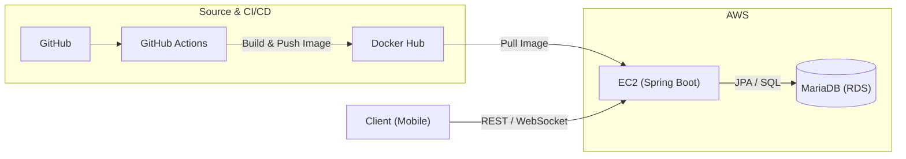
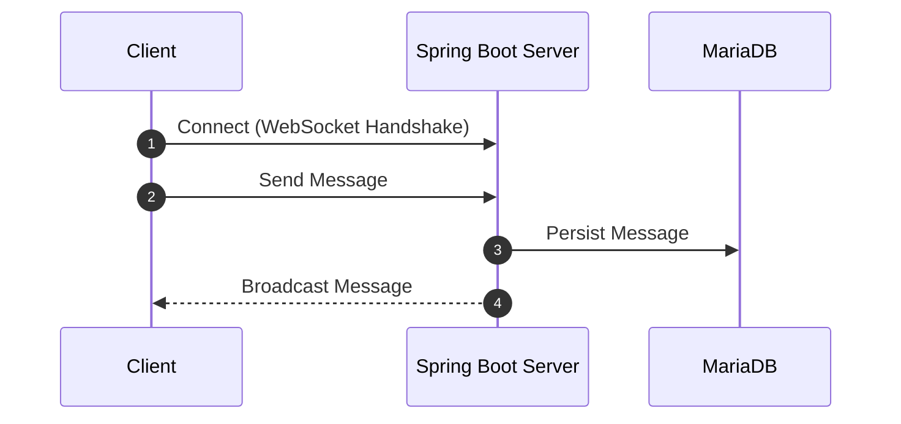
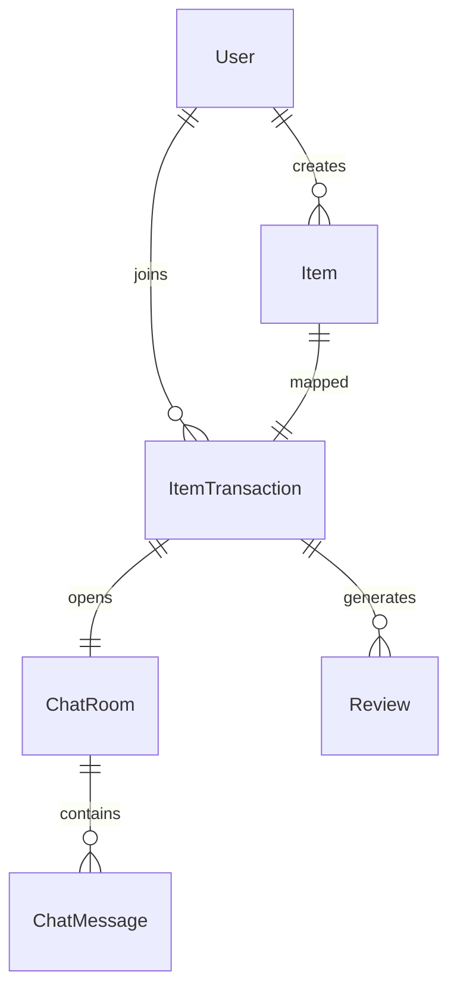

# SU-Talk Backend

이 프로젝트는 SU-Talk(수톡) 중고거래 플랫폼의 백엔드 서버입니다.  
Spring Boot 기반이며, 데이터베이스는 AWS의 MariaDB RDS를 사용합니다.

---

## 📚 기술 스택

- **Backend:** Spring Boot
- **Database:** MariaDB (Amazon RDS)
- **Deployment:** Docker, AWS EC2
- **CI/CD:** GitHub Actions + Docker 기반 자동 배포



---

## 🚩 보안 및 환경 관리리

DB 접속 정보는 환경 변수 및 GitHub Secrets를 통해 분리 관리 
EC2 SSH Key 및 민감 정보는 레포지토리에 포함하지 않음
서버–DB 간 접근 권한 최소화 설정

초기 S3/CloudFront 기반 구성 시 외부 연계 이슈가 발생하여
최종적으로 EC2 중심 구조로 전환하여 운영 안정성을 확보하였습니다.
---

## 🔧 프로젝트 DB 연결 예시 (`application.properties`)

```properties
spring.datasource.url=jdbc:mariadb://[엔드포인트]:3306/[데이터베이스이름]
spring.datasource.username=[사용자명]
spring.datasource.password=[비밀번호]
spring.jpa.hibernate.ddl-auto=update
spring.jpa.database-platform=org.hibernate.dialect.MariaDBDialect
spring.jpa.show-sql=true
```

---

# 📁 프로젝트 구조
현재 프로젝트의 기본 폴더 구조는 다음과 같습니다.

```
 src
├── main
│   ├── java
│   │   └── com.example.sutalk
│   │       ├── controller  - API 요청 처리
│   │       ├── service     - 비즈니스 로직 구현
│   │       ├── repository  - 데이터 접근 계층
│   │       └── entity      - 데이터베이스 엔티티 클래스
│   └── resources
│       └── application.properties - 설정 파일
└── test
    └── java - 테스트 코드 작성
```
도메인 중심 설계를 기반으로
게시글 – 거래 – 채팅 – 후기 – 신고 흐름이 연결되도록 모델링하였습니다.

---

# 구현 완료된 주요 기능
## 📌 게시글 (Item)
게시글 등록 (이미지 첨부 포함, Multipart 방식)

게시글 수정 / 삭제

게시글 상태 변경 (판매중, 예약중, 거래완료)

게시글 목록 조회 (카테고리/검색어 필터링, 정렬 포함)

게시글 상세 조회 (썸네일, 이미지, 판매자 프로필 포함)

## 💬 실시간 채팅 (WebSocket)
채팅방 생성 (상품 + 거래 기반, buyer/seller 자동 연결)

채팅방 목록 조회 (구매자/판매자 기준 필터링)

WebSocket 기반 실시간 채팅

채팅 메시지 저장 및 채팅 내역 불러오기

거래 완료 시 채팅 입력창 비활성화 및 안내 표시



## 🔁 거래 시스템
거래 생성 (buyer, item 기준)

채팅방과 연결된 거래 기록 관리

## ⭐ 후기 시스템
거래 완료 후 후기 작성 (구매자만 가능, 1회 제한)

별점(1~5), 코멘트 저장

판매자 프로필에서 후기 리스트 조회 가능

## 🚨 신고 기능
신고 대상 선택 (판매자/구매자)

신고 사유 + 상세 설명 입력

신고 누적 시 제재 가능 구조 고려 (기획 완료)

## 🔎 검색 기능
검색 기록 저장 (userId 기준)

검색어 자동 완성 기능 (제목 + 썸네일 이미지 포함)

추천 키워드 기반 검색 지원

## 📷 이미지 업로드
게시글 이미지 파일을 서버 로컬 디렉토리에 저장

DB에는 이미지 경로만 저장

첫 번째 이미지를 게시글 썸네일로 활용


## 🗂️ ERD 기반 연관 관계 (요약)
Item ↔ 판매자(User)

ItemTransaction ↔ 사용자(User), 게시글(Item)

ChatRoom ↔ 거래(ItemTransaction)

ChatMessage ↔ 채팅방(ChatRoom)

Review ↔ 거래(ItemTransaction)

Report ↔ 사용자(User), 게시글(Item)

SearchHistory ↔ 사용자(User)


---

# 🚀 배포 구성
GitHub Actions를 통해 main 브랜치 푸시 시 EC2 서버에 자동 배포

Docker로 패키징된 Spring Boot 애플리케이션 실행

탄력적 IP를 통한 EC2 고정 접근 경로 유지

EC2 SSH Key, 접속 정보 등은 GitHub Actions Secrets로 관리

---

# 📌 최종 결과

교내 인증 기반 안전 거래 구조 구현

실시간 채팅 및 거래 연동 로직 완성

클라우드 환경에서 정상 서비스 구동 및 시연 완료

자동 배포 환경 구축 완료 

---


