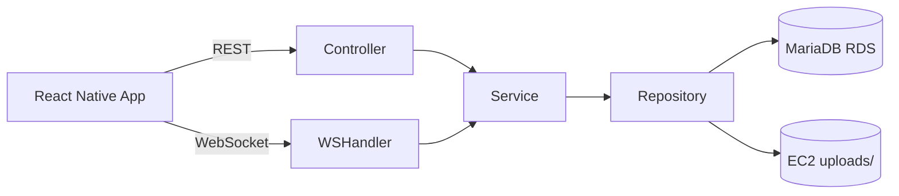
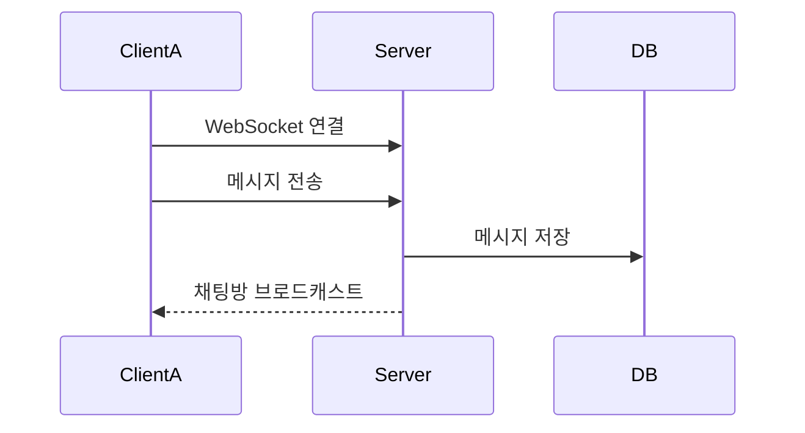
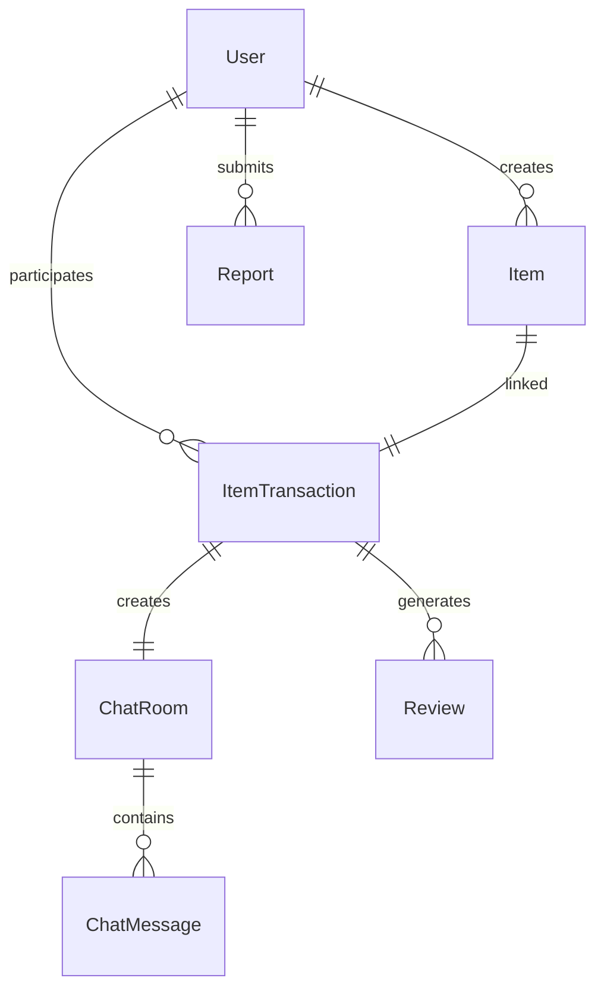
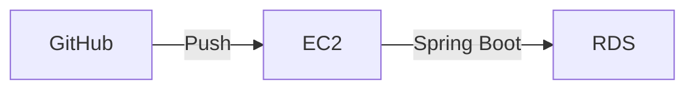

# SU-Talk (1차 버전)

삼육대학교 공식 커뮤니티 앱 SU-Talk에  
중고 물품 거래 기능을 통합한 산학연계 SW캡스톤 디자인 프로젝트입니다.

기존 게시판 기반 비공식 거래에서 발생하던  
사기 위험, 신뢰 부족 문제를 해결하기 위해  
**교내 인증 기반 폐쇄형 안전 거래 플랫폼**을 설계 및 구현하였습니다.

---

# 📌 1. 프로젝트 개요

SU-Talk은 삼육대학교 학생들이 사용하는 공식 앱입니다.

본 프로젝트는 해당 플랫폼 내에  
중고 물품 거래 기능을 추가하여 다음을 목표로 하였습니다:

- 교내 인증 기반 안전 거래 환경 구축
- 실시간 채팅 기반 거래 지원
- 게시글–거래–후기 흐름 통합
- AWS 클라우드 기반 배포 경험 확보

(프로젝트 정보 출처: 2025학년도 1학기 산학연계 SW캡스톤 디자인 프로젝트 결과보고서 :contentReference[oaicite:1]{index=1})

---

# 🛠 Tech Stack

- **Backend**: Spring Boot
- **Database**: MariaDB (AWS RDS)
- **Realtime**: WebSocket (STOMP, SockJS)
- **Infra**: AWS EC2
- **Storage**: 초기 S3 → 최종 EC2 로컬 저장
- **CI/CD**: GitHub 기반 협업 및 배포 관리
- **Frontend**: React Native (모바일 앱)

---

# 🏗 시스템 아키텍처

### 구조 설명

- REST API 기반 게시글/거래/후기 처리
- WebSocket 기반 실시간 채팅 처리
- MariaDB(RDS)에 데이터 저장
- 이미지 파일은 EC2 로컬 디렉토리 저장
- EC2 서버에서 Spring Boot 실행

---

# 💬 실시간 채팅 구조

### 설계 포인트

- 거래 생성 시 채팅방 자동 생성
- 메시지 DB 저장 후 브로드캐스트
- 거래 완료 시 채팅 입력 비활성화
- 후기 작성과 거래 상태 연계

---

# 🗂 도메인 설계 (ERD 요약)

### 설계 의도

- 게시글(Item)과 거래(ItemTransaction) 분리
- 채팅방은 거래 단위로 생성
- 거래 완료 후 후기 작성 제한
- 신고 기능을 통해 신뢰 구조 보완

---

# 🔥 주요 구현 기능

## 1️⃣ 게시글 시스템

- 제목, 가격, 이미지 포함 게시글 등록
- 수정 / 삭제 기능
- 거래 상태 변경 (판매중 / 예약중 / 거래완료)
- 검색 및 최근 검색어 관리
- 관심 상품 등록/해제

## 2️⃣ 거래 시스템

- 구매자–판매자 기반 거래 생성
- 채팅과 거래 상태 연동
- 거래 완료 후 후기 작성 가능

## 3️⃣ 실시간 채팅

- WebSocket 기반 양방향 통신
- 메시지 저장 및 채팅 로그 관리
- 거래 완료 시 채팅 제한

## 4️⃣ 후기 시스템

- 구매자 1회 제한
- 별점 + 코멘트 저장
- 마이페이지에서 후기 조회 가능

## 5️⃣ 신고 기능

- 사용자 및 게시글 신고
- 누적 제재 구조 설계

---

# ⚠️ Trouble Shooting

## 1️⃣ 클라우드 연동 이슈 (S3 → 로컬 전환)

### 문제
초기에는 AWS S3 + CloudFront 기반 정적 파일 및 이미지 저장 구조를 사용했으나,  
회사 연계 및 인증 과정에서 외부 접속/보안 이슈 발생.

### 해결
- 이미지 저장 방식을 EC2 로컬 디렉토리(`uploads/`)로 전환
- DB에는 파일 경로만 저장
- 로컬 + EC2 환경 병행 테스트

---

## 2️⃣ WebSocket 학습 및 구현 난이도

### 문제
WebSocket, STOMP, SockJS 등 실시간 통신 기술은 팀원 대부분이 처음 접함.

### 해결
- 별도 실습 프로젝트로 WebSocket 구조 사전 구현
- 메시지 송수신 흐름 반복 테스트
- DB 연동 및 거래 완료 시 채팅 제한까지 통합 구현

---

## 3️⃣ 서버 환경 구성 지연

### 문제
EC2, RDS 등 클라우드 환경 설정이 초기 진입 장벽으로 작용.

### 해결
- AWS 공식 문서 및 튜토리얼 참고
- EC2 포트 개방, RDS 연결, MariaDB 연동 단계별 실습
- 로컬–클라우드 병행 테스트로 안정화

---

# 🚀 배포 구조

- EC2 서버에 Spring Boot 배포
- RDS(MariaDB) 연동
- 클라우드 기반 서비스 시연 완료

---

# 👥 팀 구성

- 팀장 : 박민수 (개발, 서버 포팅, 백엔드)
- 팀원 : 지상혁 (개발, DB 설계, 프론트엔드)
- 팀원 : 신동원 (HTML, CSS)
- 팀원 : 김민영 (기획)
- 팀원 : 송원준 (개발)
- 개발 및 DB 설계 담당 팀원 참여
- GitHub 브랜치 전략 기반 협업
- Discord 및 Google Spreadsheet 활용 일정 관리

---

# 📊 프로젝트 성과

- 교내 인증 기반 안전 거래 구조 구현
- 실시간 채팅 통합 완료
- AWS EC2 + RDS 운영 경험 확보
- 클라우드 연계 이슈 해결 경험
- 통합 테스트 및 시연 완료

---

# 🎯 프로젝트 의의

SU-Talk은 단순 CRUD 구현이 아니라,

- 도메인 기반 설계
- 실시간 통신 기술 도입
- 클라우드 환경 배포 경험
- 팀 프로젝트 협업 경험

을 포함한 **통합 백엔드 캡스톤 프로젝트**입니다.
